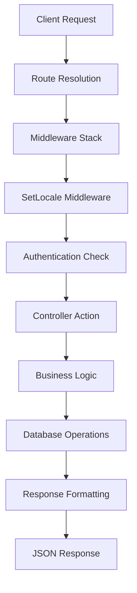

# FOODLY API - Architecture Overview

## 🏗 System Architecture

### Multi-Platform API Design
FOODLY API არის enterprise-level food delivery API with platform-specific endpoints და comprehensive authentication system.

## 📱 Platform Strategy

### Current Platforms
- **🖥 Kiosk** - Restaurant kiosk systems (Georgian locale focus)
- **📱 Android** - Mobile Android application (English locale focus)  
- **🍎 iOS** - Mobile iOS application (Russian locale focus)

### Platform Isolation Benefits
- Independent development cycles
- Platform-specific optimizations
- Targeted locale handling
- Separate scaling capabilities

## 🔐 Authentication Architecture

### Laravel Sanctum Implementation
```php
// Token-based authentication
POST /api/auth/login → returns Bearer token
Authorization: Bearer {token} → access protected endpoints
```

### Security Features
- ✅ Token-based stateless authentication
- ✅ CSRF protection for SPA
- ✅ Token expiration and refresh
- ✅ User session management

## 🌐 Internationalization (i18n)

### Locale Detection Strategy
1. **Priority 1**: Query parameter `?locale=ka`
2. **Priority 2**: Accept-Language header
3. **Fallback**: Default to English (`en`)

### Supported Markets
- `ka` - Georgia (საქართველო)
- `en` - International (English)
- `ru` - Russia/CIS (Русский)
- `tr` - Turkey (Türkiye)

## 🛣 API Routing Structure

### Route Organization
```
/api/
├── auth/           # Authentication endpoints
├── user/           # User management  
├── kiosk/          # Kiosk platform endpoints
├── android/        # Android platform endpoints
├── ios/            # iOS platform endpoints
└── test/           # Database testing utilities
```

### Middleware Stack
```php
'api' => [
    \Laravel\Sanctum\Http\Middleware\EnsureFrontendRequestsAreStateful::class,
    'throttle:api',
    \Illuminate\Routing\Middleware\SubstituteBindings::class,
]

'auth:sanctum' => [
    \Laravel\Sanctum\Http\Middleware\CheckAbility::class,
]

SetLocale::class => [
    // Custom locale detection middleware
]
```

## 📊 Data Flow Architecture

### Request Processing Flow


### Response Standards
```json
{
  "status": "success|error",
  "platform": "kiosk|android|ios",
  "locale": "ka|en|ru|tr",
  "message": "Human readable message",
  "data": {},
  "timestamp": "ISO 8601 format",
  "endpoint": "GET /api/path"
}
```

## 🎯 Scalability Considerations

### Horizontal Scaling Ready
- Stateless authentication (Sanctum tokens)
- Platform separation enables independent scaling
- Database agnostic design
- Cache-friendly architecture

### Performance Optimizations
- Route caching enabled
- Middleware optimization
- Database query optimization ready
- CDN integration ready

## 🔧 Development Environment

### Technology Stack
- **Framework**: Laravel 12.x
- **PHP**: 8.x
- **Database**: MySQL (production ready)
- **Authentication**: Laravel Sanctum
- **Localization**: astrotomic/laravel-translatable
- **Development Server**: Laravel Herd

### Local Development
```bash
# Domain
http://api.foodlyapp.test

# Database
MySQL: api_db

# Key Commands
php artisan route:list
php artisan route:clear
php artisan config:clear
```

## 📋 Current Implementation Status

### ✅ Completed Components
- Multi-platform routing architecture
- Sanctum authentication system
- Locale detection middleware
- Platform-specific controllers
- Database connectivity testing
- Comprehensive API documentation
- Postman collection for testing

### 🚀 Production Readiness
- Infrastructure framework complete
- Authentication system operational
- Multi-platform architecture established
- Locale support implemented
- Testing endpoints functional

### 🔄 Next Development Phase
Ready for business logic implementation:
- Restaurant data models
- Menu management system
- Order processing workflow
- Payment integration
- Real-time notifications
- Analytics and reporting

FOODLY API infrastructure მზადაა enterprise-level development-ისთვის! 🎯